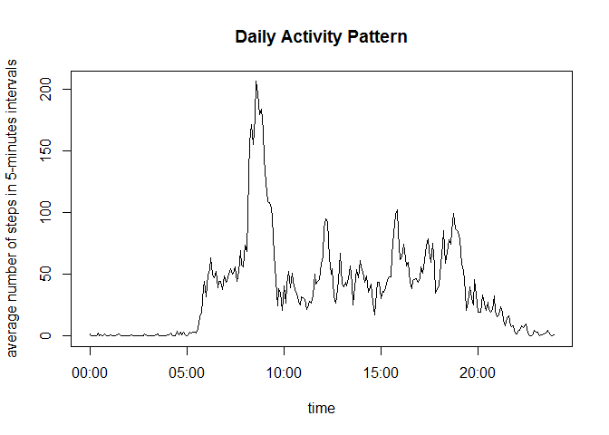

# Reproducible Research: Peer Assessment 1


## Loading and preprocessing the data

```r
unzip("activity.zip")
dat<-read.csv("activity.csv")
dat$date<-as.Date(dat$date)
```

## What is the total number of steps taken per day?

We use tapply to sum the steps by date. Note that we remove NAs.

```r
StepsPerDay<-tapply(dat$steps,dat$date,sum,na.rm=TRUE)
hist(StepsPerDay,breaks=10,xlab="Steps per day",main="Histogram of the total number of steps per day")
```

 

From the above histogram we see that there are a lot of days with apparently zero number of steps. This is actually due to missing values for entire days.  

The mean and median of the number of steps per day are 

```r
mean(StepsPerDay)
```

```
## [1] 9354.23
```

```r
median(StepsPerDay)
```

```
## [1] 10395
```

If we do not remove NAs when computing the sum of steps, we get NAs for days that have at least one NA. Hence, the historam below considers only days with full information:

```r
StepsPerDay<-tapply(dat$steps,dat$date,sum,na.rm=FALSE)
hist(StepsPerDay,breaks=10,xlab="Steps per day",main="Histogram of the total number of steps per day (only complete cases)")
```

 


The mean and median of this distribution is:

```r
mean(StepsPerDay,na.rm=TRUE)
```

```
## [1] 10766.19
```

```r
median(StepsPerDay,na.rm=TRUE)
```

```
## [1] 10765
```


## What is the average daily activity pattern?

We first create an actual time variable from the interval variable.

```r
suppressPackageStartupMessages(library(dplyr))
dat$time<-as.character(dat$interval)
dat<-mutate(dat,time=ifelse(nchar(time)==1,paste("0",time,sep=""),time))
dat<-mutate(dat,time=ifelse(nchar(time)==2,paste("0",time,sep=""),time))
dat<-mutate(dat,time=ifelse(nchar(time)==3,paste("0",time,sep=""),time))
dat<-mutate(dat,time=paste(substr(time,1,2),substr(time,3,4),sep=":"))
dat$time<-as.POSIXct(dat$time,format="%H:%M")
```

Next, we group the data by this variable and compute the mean. Then we plot the data as a function of time

```r
meanStepsPerInterval<-group_by(dat,time) %>% summarize(meanSteps=mean(steps,na.rm=TRUE),interval=interval[1])
plot(meanStepsPerInterval$time,meanStepsPerInterval$meanSteps,type="l",xlab="time",ylab="average number of steps in 5-minutes intervals",main="Daily Activity Pattern")
```

 

Which 5-minute interval, on average across all the days in the dataset, contains the maximum number of steps?


```r
meanStepsPerInterval[which.max(meanStepsPerInterval$meanSteps),"interval"]
```

```
## Source: local data frame [1 x 1]
## 
##   interval
## 1      835
```

Hence, the 5-minute interval from 8:35 to 8:40 contains on average the most steps: 

```r
max(meanStepsPerInterval$meanSteps)
```

```
## [1] 206.1698
```

## Imputing missing values

The number of incomplete cases is, i.e. at least one NA in the row:    

```r
sum(!complete.cases(dat))
```

```
## [1] 2304
```

We impute values by using the mean number of steps of the respective 5-minute interval.

```r
dat_imputed <- dat
for(i in 1:length(dat_imputed$steps)){
        if(is.na(dat_imputed$steps[i])==TRUE ){
                dat_imputed$steps[i]<- 
                      as.numeric(meanStepsPerInterval[meanStepsPerInterval$interval==dat_imputed$interval[i],"meanSteps"])
        }
}
```

We use again tapply to sum the steps by date. 

```r
StepsPerDayImputed<-tapply(dat_imputed$steps,dat$date,sum,na.rm=TRUE)
hist(StepsPerDayImputed,breaks=10,xlab="Steps per Day",main="Histogram of total number of steps per day (after imputing)")
```

 

The mean and median of the total number of steps are now:

```r
mean(StepsPerDayImputed)
```

```
## [1] 10766.19
```

```r
median(StepsPerDayImputed)
```

```
## [1] 10766.19
```
The numbers are as expected close to the numbers when incomplete cases are not considered at all (see above).


## Are there differences in activity patterns between weekdays and weekends?
Set the locale to US in order to get the weekdays in English.

```r
Sys.setlocale(category = "LC_ALL", locale = "US")
```

```
## [1] "LC_COLLATE=English_United States.1252;LC_CTYPE=English_United States.1252;LC_MONETARY=English_United States.1252;LC_NUMERIC=C;LC_TIME=English_United States.1252"
```

We create a factor variable called *day* with two levels - "weekday" and "weekend" indicating whether a given date is a weekday or weekend day:

```r
dat_imputed$day<-factor(ifelse(weekdays(dat_imputed$date) %in% c("Saturday","Sunday"),"Weekend","Weekday"))
```

Now we group the data by day-type and time interval and compute the mean number of steps for each group.


```r
meanStepsPerInterval<-
      group_by(dat_imputed,day,time) %>% summarize(meanSteps=mean(steps),interval=interval[1])
```

We plot the time series using ggplot2 for the weekdays and weekend.

```r
library(ggplot2)
library(scales)
qplot(time,meanSteps,data=meanStepsPerInterval,facets=  day ~ ., geom="line") + scale_x_datetime( breaks=("2 hour"), minor_breaks=("1 hour"), labels=date_format("%H:%M"))+ylab("average number of steps in 5-minute intervals")
```

 

As one can see from the above time series plots, on weekdays the people in this study get up earlier (around 6am) and are most active around 8:30am when they presumably go to work. During the weekends, they tend to sleep longer and are more active during the day. 
